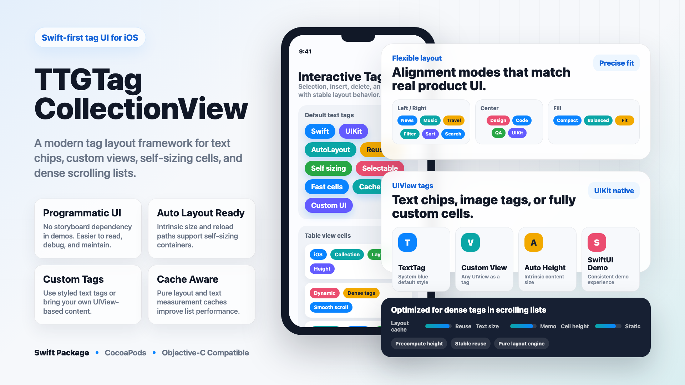
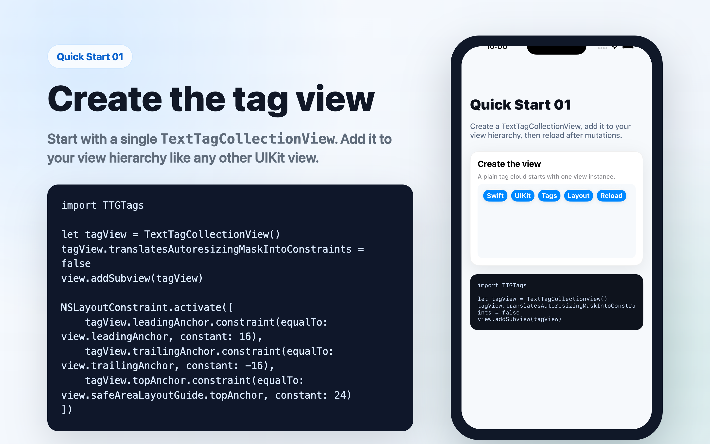
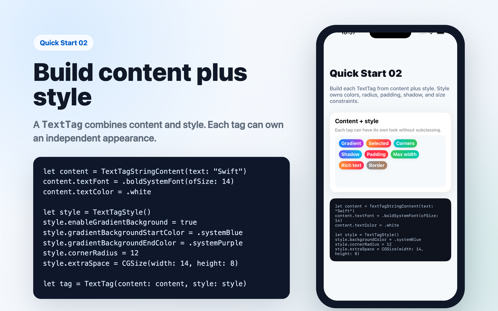
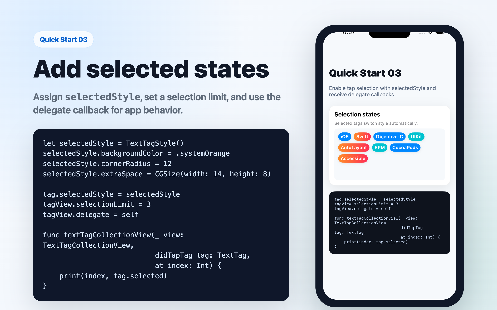
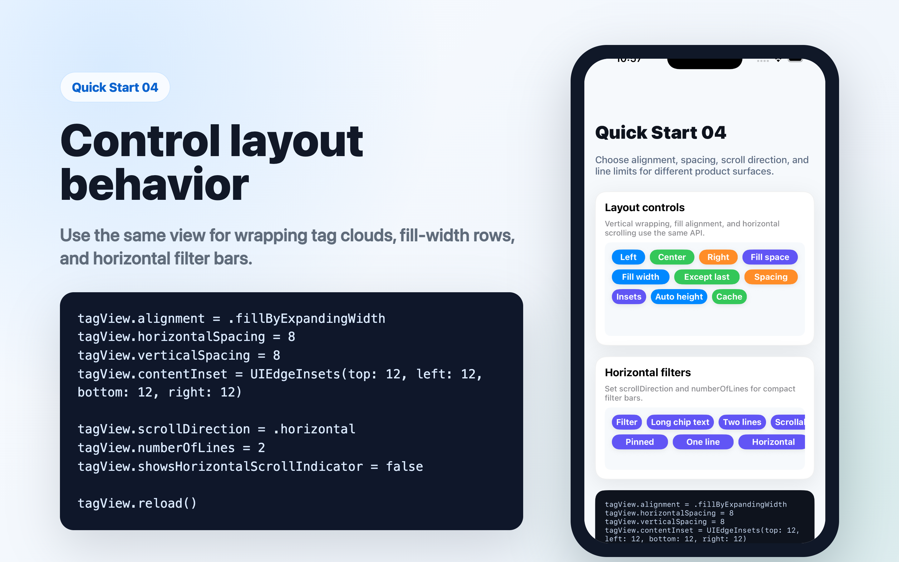
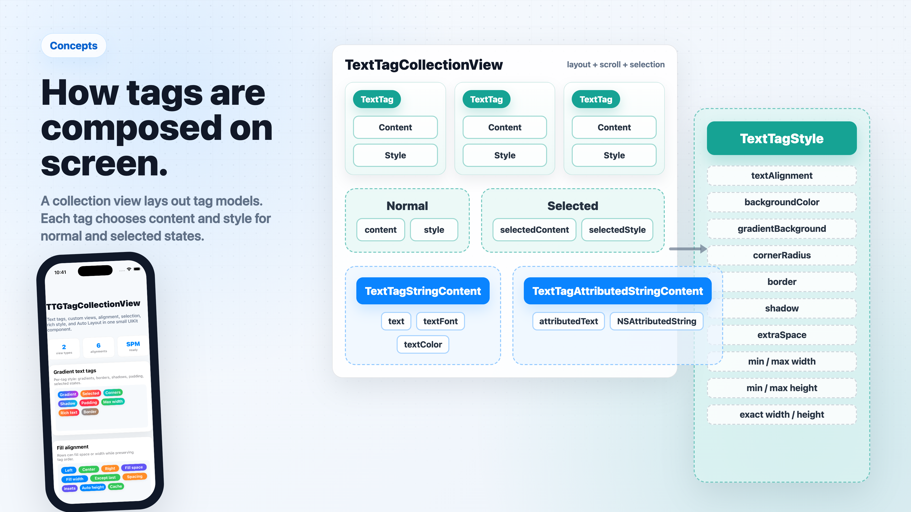
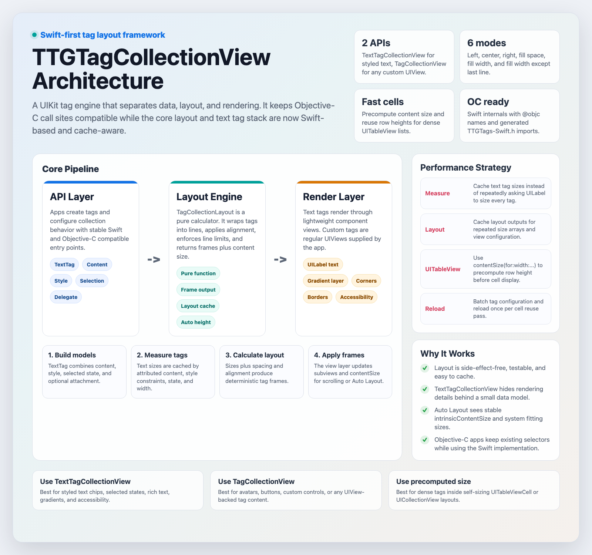

# TTGTagCollectionView

[](http://cocoapods.org/pods/TTGTagCollectionView)
[](http://cocoapods.org/pods/TTGTagCollectionView)
[](http://cocoapods.org/pods/TTGTagCollectionView)

**[中文文档 ->](README_CN.md)**

TTGTagCollectionView is a Swift-first iOS tag layout component. Use it for filter chips, topic labels, search facets, dense table cells, custom tag views, and any UI that needs predictable wrapping or horizontal tag rows.



## Highlights

- **Text tags or custom views**: `TextTagCollectionView` for styled text, `TagCollectionView` for arbitrary `UIView` content.
- **Flexible layout**: vertical wrapping, horizontal scrolling, line limits, spacing, insets, and 6 alignment modes.
- **Per-tag appearance**: gradient backgrounds, borders, shadows, corner radius, padding, size constraints, and selected states.
- **AutoLayout friendly**: intrinsic size updates and `preferredMaxLayoutWidth` for stack views, forms, and self-sizing cells.
- **Cache-aware performance**: text measurement cache, pure layout cache, and precomputed content-size APIs for dense lists.
- **Swift and Objective-C**: modern Swift sources with Objective-C-compatible names and selectors.

## Requirements

- iOS 16.0+
- Swift 5.9+
- Xcode 15+

## Installation

### Swift Package Manager

In Xcode, choose **File -> Add Package Dependencies** and enter:

```text
https://github.com/zekunyan/TTGTagCollectionView.git
```

Or add it to `Package.swift`:

```swift
dependencies: [
    .package(url: "https://github.com/zekunyan/TTGTagCollectionView.git", from: "3.3.0")
]
```

### CocoaPods

```ruby
pod 'TTGTagCollectionView'
```

## Quick Start

The screenshots below are generated from the Swift example app running in an iOS Simulator.

### 1. Create the view



```swift
import TTGTags

let tagView = TextTagCollectionView()
tagView.translatesAutoresizingMaskIntoConstraints = false
view.addSubview(tagView)

NSLayoutConstraint.activate([
    tagView.leadingAnchor.constraint(equalTo: view.leadingAnchor, constant: 16),
    tagView.trailingAnchor.constraint(equalTo: view.trailingAnchor, constant: -16),
    tagView.topAnchor.constraint(equalTo: view.safeAreaLayoutGuide.topAnchor, constant: 24)
])
```

### 2. Build content plus style



Each `TextTag` is built from content and style. The same model also carries selection state, accessibility metadata, and optional attachment data.

```swift
let content = TextTagStringContent(text: "Swift")
content.textFont = .boldSystemFont(ofSize: 14)
content.textColor = .white

let style = TextTagStyle()
style.enableGradientBackground = true
style.gradientBackgroundStartColor = .systemBlue
style.gradientBackgroundEndColor = .systemPurple
style.cornerRadius = 12
style.extraSpace = CGSize(width: 14, height: 8)

let tag = TextTag(content: content, style: style)
tagView.add(tag: tag)
tagView.reload()
```

### 3. Add selected states



`selectedStyle` is applied automatically when a tag is selected. Use `selectionLimit` and the delegate callbacks for app-specific behavior.

```swift
let selectedStyle = TextTagStyle()
selectedStyle.backgroundColor = .systemOrange
selectedStyle.cornerRadius = 12
selectedStyle.extraSpace = CGSize(width: 14, height: 8)

tag.selectedStyle = selectedStyle
tagView.selectionLimit = 3
tagView.delegate = self
```

### 4. Control layout behavior



Use the same view for normal wrapping tag clouds, fill-width rows, or horizontal filter bars.

```swift
tagView.alignment = .fillByExpandingWidth
tagView.horizontalSpacing = 8
tagView.verticalSpacing = 8
tagView.contentInset = UIEdgeInsets(top: 12, left: 12, bottom: 12, right: 12)

tagView.scrollDirection = .horizontal
tagView.numberOfLines = 2
tagView.showsHorizontalScrollIndicator = false

tagView.reload()
```

### Objective-C

```objc
#import <TTGTags/TTGTags-Swift.h>

TTGTextTagCollectionView *tagView = [[TTGTextTagCollectionView alloc] initWithFrame:self.view.bounds];
[self.view addSubview:tagView];

TTGTextTagStringContent *content = [TTGTextTagStringContent contentWithText:@"Hello"];
TTGTextTagStyle *style = [TTGTextTagStyle new];
style.backgroundColor = UIColor.systemBlueColor;
style.cornerRadius = 10;
style.extraSpace = CGSizeMake(12, 8);

TTGTextTag *tag = [TTGTextTag tagWithContent:content style:style];
[tagView addTag:tag];
[tagView reload];
```

## Concepts

Understanding these 4 building blocks will help you use the library effectively:



| Concept | Class | Role |
|---|---|---|
| **Tag** | `TextTag` | Data model: holds content, style, selection state, and an optional `attachment` |
| **Content** | `TextTagStringContent` / `TextTagAttributedStringContent` | What text to display, with font and color |
| **Style** | `TextTagStyle` | Visual appearance: background, gradient, corners, border, shadow, size |
| **Collection View** | `TextTagCollectionView` / `TagCollectionView` | Container that lays out tags with alignment, spacing, and scroll |

> **Key rule**: always call `reload()` after adding, removing, or updating tags.

## Visual Assets

- Promo poster: [Resources/promo_poster.png](Resources/promo_poster.png)
- Quick Start images: [Resources/quick_start_01_create.png](Resources/quick_start_01_create.png), [Resources/quick_start_02_style.png](Resources/quick_start_02_style.png), [Resources/quick_start_03_selection.png](Resources/quick_start_03_selection.png), [Resources/quick_start_04_layout.png](Resources/quick_start_04_layout.png)
- Concepts image: [Resources/concepts_poster.png](Resources/concepts_poster.png)
- Review HTML: [Resources/promo_poster.html](Resources/promo_poster.html), [Resources/quick_start_01_create.html](Resources/quick_start_01_create.html), [Resources/quick_start_02_style.html](Resources/quick_start_02_style.html), [Resources/quick_start_03_selection.html](Resources/quick_start_03_selection.html), [Resources/quick_start_04_layout.html](Resources/quick_start_04_layout.html)
- Regenerate PNG assets with `node Resources/render_readme_images.mjs`.

## Architecture at a Glance



The architecture poster is generated from [Resources/architecture_poster.html](Resources/architecture_poster.html). It summarizes the Swift-first architecture, Objective-C compatibility layer, pure layout engine, rendering flow, and the cache-aware path used for dense tag lists.

## Usage

### Delegate

```swift
tagView.delegate = self

// TextTagCollectionViewDelegate
func textTagCollectionView(_ collectionView: TextTagCollectionView,
                           canTapTag tag: TextTag, at index: Int) -> Bool { true }

func textTagCollectionView(_ collectionView: TextTagCollectionView,
                           didTapTag tag: TextTag, at index: Int) {
    print("tapped: \(tag.rightfulContent.contentAttributedString.string), selected: \(tag.selected)")
}

func textTagCollectionView(_ collectionView: TextTagCollectionView,
                           canSwipeSelectTag tag: TextTag, at index: Int) -> Bool { true }

func textTagCollectionView(_ collectionView: TextTagCollectionView,
                           didSwipeSelectTag tag: TextTag, at index: Int) {
    print("swipe selected: \(index)")
}

func textTagCollectionView(_ collectionView: TextTagCollectionView,
                           updateContentSize contentSize: CGSize) {
    // e.g. update a height constraint
}
```

### Content types

```swift
// Plain text
let c1 = TextTagStringContent(text: "Hello")
c1.textFont  = .systemFont(ofSize: 14)
c1.textColor = .darkText

// Rich text via NSAttributedString
let attrs: [NSAttributedString.Key: Any] = [
    .foregroundColor: UIColor.systemRed,
    .font: UIFont.boldSystemFont(ofSize: 16)
]
let c2 = TextTagAttributedStringContent(
    attributedText: NSAttributedString(string: "Rich", attributes: attrs)
)
```

### Style properties — TextTagStyle

```swift
let style = TextTagStyle()

// Background
style.backgroundColor = .systemBlue
style.textAlignment = .center
style.numberOfLines = 1                  // 0 = unlimited multiline
style.lineBreakMode = .byTruncatingTail

// Gradient background
style.enableGradientBackground        = true
style.gradientBackgroundStartColor    = .systemBlue
style.gradientBackgroundEndColor      = .systemPurple
style.gradientBackgroundStartPoint    = CGPoint(x: 0, y: 0.5)
style.gradientBackgroundEndPoint      = CGPoint(x: 1, y: 0.5)

// Corner (all corners by default; set individual flags for per-corner control)
style.cornerRadius      = 14
style.cornerTopLeft     = true
style.cornerTopRight    = true
style.cornerBottomLeft  = false
style.cornerBottomRight = false

// Border
style.borderWidth = 1
style.borderColor = .white

// Shadow
style.shadowColor   = .black
style.shadowOffset  = CGSize(width: 2, height: 2)
style.shadowRadius  = 2
style.shadowOpacity = 0.3

// Size
style.extraSpace  = CGSize(width: 12, height: 6)  // padding
style.minWidth    = 60      // 0 = no limit
style.maxWidth    = 200
style.exactWidth  = 0       // 0 = auto
style.exactHeight = 32
```

### Layout configuration

```swift
tagView.scrollDirection  = .vertical     // .vertical (default) or .horizontal
tagView.alignment        = .left         // see Alignment below
tagView.horizontalDistribution = .rowMajor
tagView.contentVerticalAlignment = .top
tagView.numberOfLines    = 0             // 0 = unlimited
tagView.selectionLimit   = 3             // 0 = unlimited
tagView.horizontalSpacing = 8
tagView.verticalSpacing   = 8
tagView.contentInset      = UIEdgeInsets(top: 8, left: 8, bottom: 8, right: 8)

// AutoLayout manual height
tagView.manualCalculateHeight   = true
tagView.preferredMaxLayoutWidth = 320

// Tap callbacks (no delegate needed)
tagView.onTapBlankArea = { point in print("tapped blank at \(point)") }
tagView.onTapAllArea   = { point in print("tapped anywhere at \(point)") }
```

### Alignment modes

| Swift | Description |
|---|---|
| `.left` | Left-aligned (default) |
| `.center` | Center-aligned |
| `.right` | Right-aligned |
| `.fillByExpandingSpace` | Expand spacing between tags to fill each row |
| `.fillByExpandingWidth` | Expand each tag's width to fill each row |
| `.fillByExpandingWidthExceptLastLine` | Same as above but skip the last row |

### Horizontal rows and vertical placement

```swift
// Natural reading order in horizontal multi-line rows (default in 3.1)
tagView.scrollDirection = .horizontal
tagView.numberOfLines = 2
tagView.horizontalDistribution = .rowMajor

// Preserve the old round-robin column-first behavior when needed
tagView.horizontalDistribution = .columnMajor

// Center content inside a fixed-height tag surface
tagView.contentVerticalAlignment = .center
```

### Multiline text tags

```swift
let content = TextTagStringContent(text: "Long filter label that can wrap")
let style = TextTagStyle()
style.numberOfLines = 0
style.maxWidth = 180
style.lineBreakMode = .byWordWrapping

let tag = TextTag(content: content, style: style)
```

### Tag model — TextTag

```swift
let tag = TextTag()

// Content & style for normal / selected state
tag.content         = TextTagStringContent(text: "Label")
tag.style           = TextTagStyle()
tag.selectedContent = TextTagStringContent(text: "Selected")   // optional, falls back to content copy
tag.selectedStyle   = TextTagStyle()                           // optional, falls back to style copy

// Selection
tag.selected = false
tag.onSelectStateChanged = { selected in print(selected) }

// Attach any object
tag.attachment = myModel

// Accessibility
tag.enableAutoDetectAccessibility = true   // auto sets label + traits from content
// or manually:
tag.isAccessibilityElement  = true
tag.accessibilityLabel      = "My tag"
tag.accessibilityHint       = "Double tap to select"
tag.accessibilityTraits     = .button

// Current active content / style (respects selected state)
let activeContent = tag.rightfulContent
let activeStyle   = tag.rightfulStyle
```

### Mutating tags

```swift
// Add
tagView.add(tag: tag)
tagView.add(tags: [tag1, tag2])

// Insert
tagView.insert(tag: tag, at: 0)
tagView.insert(tags: [tag1, tag2], at: 2)

// Update
tagView.updateTag(at: 0, selected: true)
tagView.updateTag(at: 0, with: newTag)
tagView.updateTag(byId: tag.tagId, selected: true)
tagView.updateTag(byId: tag.tagId, with: newTag)

// Remove
tagView.remove(tag: tag)
tagView.removeTag(byId: tag.tagId)
tagView.removeTag(at: 0)
tagView.removeAllTags()

// Move (auto reloads)
tagView.moveTag(at: 0, to: 3)
tagView.moveTag(byId: tag.tagId, to: 1)

// Query
let tag  = tagView.getTag(at: 0)
let sameTag = tagView.getTag(byId: tagId)
let index = tagView.indexOfTag(byId: tagId)
let tags = tagView.getTags(in: NSRange(location: 0, length: 3))
let all      = tagView.allTags()
let selected = tagView.allSelectedTags()
let unselected = tagView.allNotSelectedTags()

// Reload (required after any mutation)
tagView.reload()
```

### Hit-testing

```swift
let index = tagView.indexOfTag(at: touchPoint)   // NSNotFound if missed
```

### Scroll to a tag

```swift
tagView.scrollToTag(at: 12, position: .center, animated: true)
tagView.scrollToTag(byId: tag.tagId, position: .end, animated: true)
```

### Swipe selection

`TextTagCollectionView` can select tags as the user's finger moves across them. Swipe selection is opt-in, selects only unselected tags, and respects `selectionLimit`.

```swift
tagView.enableSwipeSelection = true
tagView.selectionLimit = 6
tagView.delegate = self

func textTagCollectionView(_ collectionView: TextTagCollectionView,
                           canSwipeSelectTag tag: TextTag,
                           at index: Int) -> Bool {
    return true
}

func textTagCollectionView(_ collectionView: TextTagCollectionView,
                           didSwipeSelectTag tag: TextTag,
                           at index: Int) {
    print("swipe selected \(index)")
}
```

```objc
tagView.enableSwipeSelection = YES;
tagView.selectionLimit = 6;
```

### Reorder and drag-to-delete

`TextTagCollectionView` can reorder text tags with a long-press drag gesture. Drag-to-delete is opt-in and shows a bottom delete zone while dragging.

```swift
tagView.enableTagReordering = true
tagView.enableDragToDelete = true
tagView.enableTagSelection = false
tagView.delegate = self

// Optional delete-zone styling
tagView.dragDeleteZoneHeight = 52
tagView.dragDeleteZoneInsets = UIEdgeInsets(top: 0, left: 18, bottom: 12, right: 18)
tagView.dragDeleteZoneCornerRadius = 16
tagView.dragDeleteZoneBackgroundColor = UIColor.systemGray.withAlphaComponent(0.92)
tagView.dragDeleteZoneHighlightedBackgroundColor = UIColor.systemPink.withAlphaComponent(0.96)
tagView.dragDeleteZoneText = "Drop tag to remove"
tagView.dragDeleteZoneTextColor = .white
tagView.dragDeleteZoneFont = .systemFont(ofSize: 15, weight: .semibold)
tagView.dragDeleteZoneImage = UIImage(systemName: "trash.fill")
tagView.dragDeleteZoneImageTintColor = .white
```

```swift
func textTagCollectionView(_ collectionView: TextTagCollectionView,
                           canMoveTag tag: TextTag,
                           fromIndex: Int,
                           toIndex: Int) -> Bool {
    return true
}

func textTagCollectionView(_ collectionView: TextTagCollectionView,
                           didMoveTag tag: TextTag,
                           fromIndex: Int,
                           toIndex: Int) {
    print("moved \(fromIndex) -> \(toIndex)")
}

func textTagCollectionView(_ collectionView: TextTagCollectionView,
                           canDeleteTag tag: TextTag,
                           at index: Int) -> Bool {
    return true
}

func textTagCollectionView(_ collectionView: TextTagCollectionView,
                           didDeleteTag tag: TextTag,
                           at index: Int) {
    print("deleted \(index)")
}
```

Objective-C uses the same API through `TTGTags-Swift.h`:

```objc
tagView.enableTagReordering = YES;
tagView.enableDragToDelete = YES;
[tagView moveTagAtIndex:0 toIndex:3];
[tagView moveTagById:tag.tagId toIndex:1];

tagView.dragDeleteZoneHeight = 52;
tagView.dragDeleteZoneInsets = UIEdgeInsetsMake(0, 18, 12, 18);
tagView.dragDeleteZoneBackgroundColor = [UIColor.systemGrayColor colorWithAlphaComponent:0.92];
tagView.dragDeleteZoneHighlightedBackgroundColor = [UIColor.systemPinkColor colorWithAlphaComponent:0.96];
tagView.dragDeleteZoneText = @"Drop tag to remove";
tagView.dragDeleteZoneImage = [UIImage systemImageNamed:@"trash.fill"];
```

---

### TagCollectionView — custom views

Use `TagCollectionView` when your tags are arbitrary `UIView` subclasses instead of text.

```swift
tagCollectionView.dataSource = self
tagCollectionView.delegate   = self

// TagCollectionViewDataSource
func numberOfTags(in tagCollectionView: TagCollectionView) -> Int { items.count }

func tagCollectionView(_ tagCollectionView: TagCollectionView,
                       tagViewFor index: Int) -> UIView { myViews[index] }

// TagCollectionViewDelegate
func tagCollectionView(_ tagCollectionView: TagCollectionView,
                       sizeForTagAt index: Int) -> CGSize { myViews[index].frame.size }

func tagCollectionView(_ tagCollectionView: TagCollectionView,
                       didSelectTag tagView: UIView, at index: Int) {
    print("selected \(index)")
}

func tagCollectionView(_ tagCollectionView: TagCollectionView,
                       updateContentSize contentSize: CGSize) { }

// Reload
tagCollectionView.reload()
```

All layout and spacing properties (`scrollDirection`, `alignment`, `horizontalDistribution`, `contentVerticalAlignment`, `numberOfLines`, `horizontalSpacing`, `verticalSpacing`, `contentInset`, `manualCalculateHeight`, `preferredMaxLayoutWidth`) are identical to `TextTagCollectionView`.

---

## Performance

TTGTagCollectionView keeps layout deterministic and cache-friendly:

- `TagCollectionLayout` is a pure calculator: the same tag sizes and configuration produce the same frames and content size.
- `TextTagCollectionView` caches text tag measurements by attributed content, style constraints, selected state, and available width.
- Layout results are cached for repeated tag size arrays and collection view configuration.
- `TextTagCollectionView.contentSize(for:width:...)` lets table/list screens precompute row height without creating or laying out a cell.
- Demo table cells batch tag configuration and call `reload()` once per reuse pass.

### Dense tags inside UITableViewCell

For smooth scrolling, build tag models once, cache the row height by table width, and configure the cell in one pass:

```swift
let tagSize = TextTagCollectionView.contentSize(
    for: tags,
    width: availableTagWidth,
    scrollDirection: .vertical,
    alignment: .fillByExpandingWidth,
    horizontalDistribution: .rowMajor,
    numberOfLines: 0,
    horizontalSpacing: 8,
    verticalSpacing: 8,
    contentInset: UIEdgeInsets(top: 4, left: 0, bottom: 4, right: 0)
)

let rowHeight = titleHeight + tagSize.height + verticalPadding
```

Objective-C uses the same API through `TTGTags-Swift.h`:

```objc
CGSize tagSize = [TTGTextTagCollectionView contentSizeForTags:tags
                                                        width:availableTagWidth
                                              scrollDirection:TTGTagCollectionScrollDirectionVertical
                                                    alignment:TTGTagCollectionAlignmentFillByExpandingWidth
                                       horizontalDistribution:TTGTagCollectionHorizontalDistributionRowMajor
                                                numberOfLines:0
                                            horizontalSpacing:8
                                              verticalSpacing:8
                                                 contentInset:UIEdgeInsetsMake(4, 0, 4, 0)];
```

When data changes globally or you need to benchmark a cold path, clear both caches:

```swift
TextTagCollectionView.clearMeasurementCache()
```

---

## Tips

- Always call `reload()` after adding, removing, or updating tags.
- `moveTag(at:to:)` and `moveTag(byId:to:)` reload automatically.
- Swipe selection starts only from a tag, selects unselected tags, and does not toggle already selected tags off.
- Drag-to-delete is destructive. Use `canDeleteTag` to block protected tags or the last remaining tag.
- When embedding in a `UITableViewCell`, prefer precomputing row height with `TextTagCollectionView.contentSize(for:width:...)` and reusing the result by table width.
- Configure all tags first, then call `reload()` once. Avoid repeated `updateTag(...)` calls during cell reuse.
- Use `manualCalculateHeight = true` + `preferredMaxLayoutWidth` when the view's width is not yet determined at layout time.

---

## Source Structure

```
Sources/TTGTags/
├── Model/
│   ├── TextTag.swift                         # Tag data model (id, content, style, selection)
│   ├── TextTagContent.swift                  # Abstract content base class
│   ├── TextTagStringContent.swift            # Plain text content
│   └── TextTagAttributedStringContent.swift  # NSAttributedString content
├── Style/
│   └── TextTagStyle.swift                    # Visual style (background, border, shadow, corner, size)
├── Layout/
│   └── TagCollectionLayout.swift             # Pure layout calculator (no UIKit side effects)
└── View/
    ├── TagCollectionView.swift               # Custom-view tag collection
    ├── TextTagCollectionView.swift            # Text tag collection
    └── Internal/
        ├── TextTagComponentView.swift        # Per-tag rendering view
        └── TextTagGradientLabel.swift        # CAGradientLayer-backed label

Tests/TTGTagsTests/
├── TagCollectionLayoutTests.swift
├── TextTagTests.swift
└── TextTagContentTests.swift
```

---

## 3.0 Migration Guide

Version 3.0 rewrites all core sources in Swift. Objective-C class names, selectors, and enum cases are fully preserved via `@objc(TTGXxx)` aliases — existing OC call sites need only one change: replace the old `.h` imports with the Swift generated umbrella header.

**One-line OC migration:**

```objc
// Before (2.x)
#import <TTGTags/TTGTextTagCollectionView.h>

// After (3.0+)
#import <TTGTags/TTGTags-Swift.h>
```

### Swift API mapping

| 2.x / Objective-C | 3.0 Swift |
|---|---|
| `TTGTagCollectionView` | `TagCollectionView` |
| `TTGTextTagCollectionView` | `TextTagCollectionView` |
| `TTGTextTag` | `TextTag` |
| `TTGTextTagStyle` | `TextTagStyle` |
| `TTGTextTagContent` | `TextTagContent` |
| `TTGTextTagStringContent` | `TextTagStringContent` |
| `TTGTextTagAttributedStringContent` | `TextTagAttributedStringContent` |
| `TTGTagCollectionAlignment` | `TagCollectionAlignment` |
| `TTGTagCollectionScrollDirection` | `TagCollectionScrollDirection` |
| `[tag getRightfulContent]` | `tag.rightfulContent` |
| `[tag getRightfulStyle]` | `tag.rightfulStyle` |
| `[content getContentAttributedString]` | `content.contentAttributedString` |
| `[tagView addTag:]` | `tagView.add(tag:)` |
| `[tagView insertTag:atIndex:]` | `tagView.insert(tag:at:)` |
| `[tagView removeTagAtIndex:]` | `tagView.removeTag(at:)` |
| `[tagView getTagAtIndex:]` | `tagView.getTag(at:)` |
| `[tagView updateTagAtIndex:selected:]` | `tagView.updateTag(at:selected:)` |

### Other changes in 3.0

- Minimum deployment target raised from iOS 11 to **iOS 16**
- `tagId` auto-increment is now thread-safe (`NSLock`)
- Per-corner `UIRectCorner` bitmask bug fixed
- Pure layout calculator `TagCollectionLayout` extracted (fully unit-tested)
- Text measurement and layout caches added for dense tag lists
- `TextTagCollectionView.contentSize(for:width:...)` added for precomputing list row height
- SPM test target added (`Tests/TTGTagsTests`)

### 3.1 API additions

- Horizontal multi-line rows now default to `.rowMajor`, matching natural reading order.
- `.columnMajor` keeps the previous round-robin horizontal distribution when apps need it.
- `contentVerticalAlignment` can place short tag content at the top, center, or bottom of a fixed-height tag view.
- `TextTagStyle.numberOfLines` and `lineBreakMode` enable multiline text tags with `maxWidth` or container-width constraints.
- `getTag(byId:)`, `indexOfTag(byId:)`, `updateTag(byId:...)`, and `scrollToTag(byId:...)` make id-driven updates straightforward.
- `scrollToTag(at:position:animated:)` supports `.nearest`, `.start`, `.center`, and `.end`.

### 3.2 API additions

- `enableTagReordering` enables long-press drag reordering for `TextTagCollectionView`.
- `enableDragToDelete` shows a bottom delete zone while dragging.
- `dragDeleteZoneHeight`, `dragDeleteZoneInsets`, colors, text, font, image, and tint properties customize the delete zone without replacing its view.
- `moveTag(at:to:)` and `moveTag(byId:to:)` support programmatic reordering.
- `canMoveTag` / `didMoveTag` and `canDeleteTag` / `didDeleteTag` cover reorder and delete decisions.
- SwiftUI `TagCloudView` does not expose reordering yet because it rebuilds tags from value input on each update; use UIKit `TextTagCollectionView` for reorder/delete workflows.

### Swipe selection API additions

- `enableSwipeSelection` enables finger-swipe selection for `TextTagCollectionView`.
- `canSwipeSelectTag` / `didSwipeSelectTag` cover swipe selection decisions and results.
- Swipe selection falls back to `canTapTag` when `canSwipeSelectTag` is not implemented, so existing selection gates still apply.

---

## Author

zekunyan — zekunyan@163.com

## License

TTGTagCollectionView is available under the MIT license. See the LICENSE file for more info.
